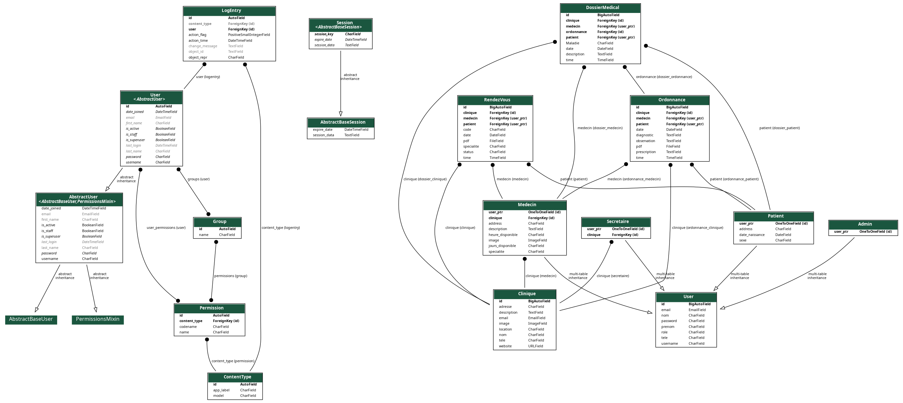

# HealthHub

HealthHub is a Django-based web application designed to streamline the management of clinics, doctors, patients, appointments, and medical records. It provides a platform for patients to schedule appointments with doctors, access medical records, and receive prescriptions. It also offers administrative features for managing clinics and user roles.

## Features

- User registration and authentication system for doctors, patients, secretaries, and administrators.
- Clinic management with details such as name, address, description, image, contact information, and website.
- Doctors can create their profiles with specialties, availability, contact information, and associated clinics.
- Patients can create profiles, update personal information, and view their medical records.
- Appointment scheduling system for patients to book appointments with doctors at specific clinics.
- Administrative functionalities for managing clinics, users, and appointments.
- Medical record management for doctors to create prescriptions, diagnose patients, and store relevant information.


## UML Diagram



The UML diagram provides an overview of the main entities and their relationships in the HealthHub application.


## Installation

1. Clone the repository:

```shell
git clone https://github.com/your-username/HealthHub.git
```


2. Create a virtual environment:

```shell
cd HealthHub
python3 -m venv venv
```

3. Activate the virtual environment:

```shell
# For Unix/Linux
source venv/bin/activate

# For Windows
venv\Scripts\activate

```

4. Install the project dependencies:


```shell
pip install -r requirements.txt
```

5. Run database migrations:


```shell
python manage.py migrate
```

6. Start the development server:


```shell
python manage.py runserver
```


##Contributing

Contributions to HealthHub are welcome! If you encounter any issues or have suggestions for improvements, please create a new issue or submit a pull request.
