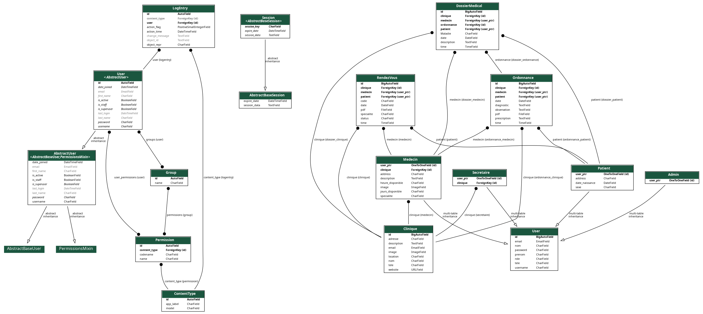
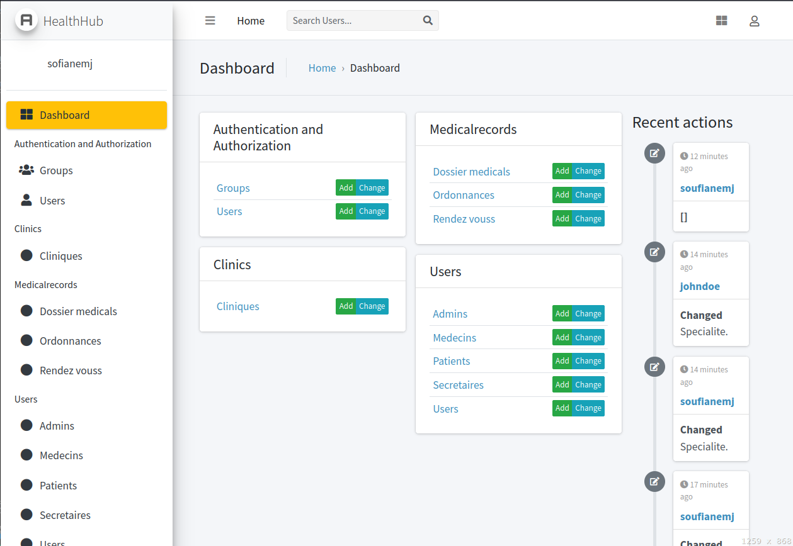
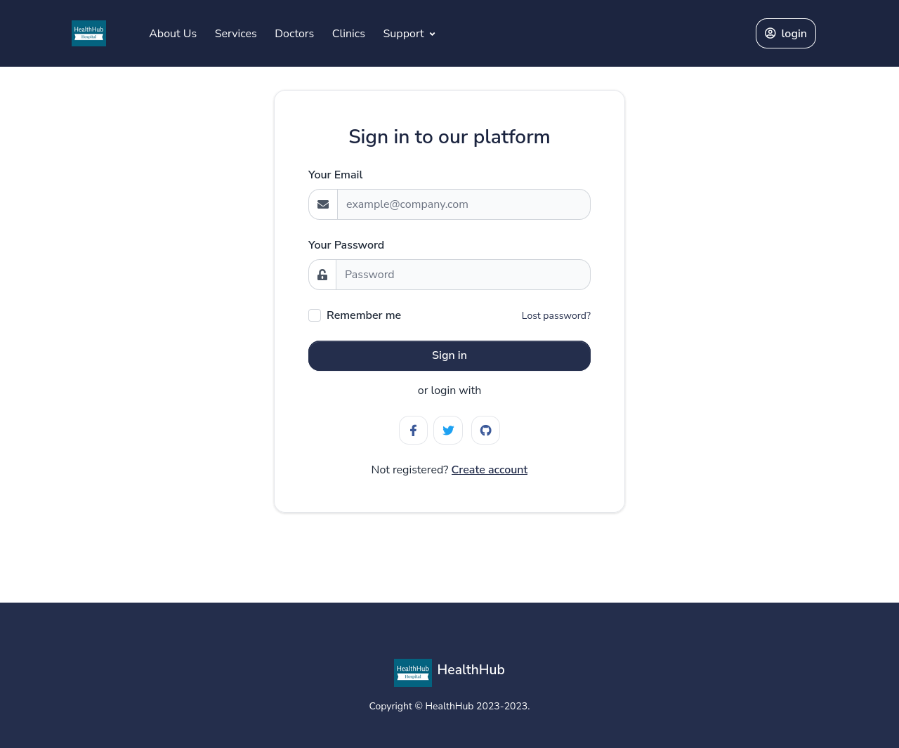
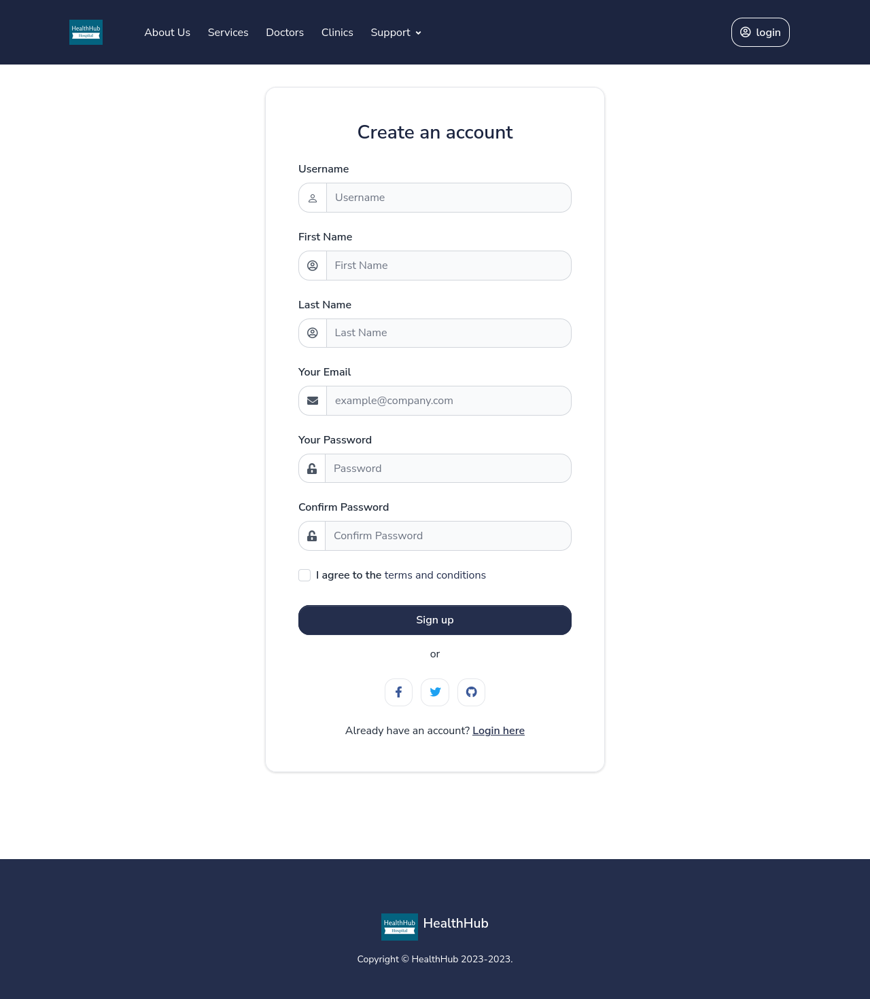
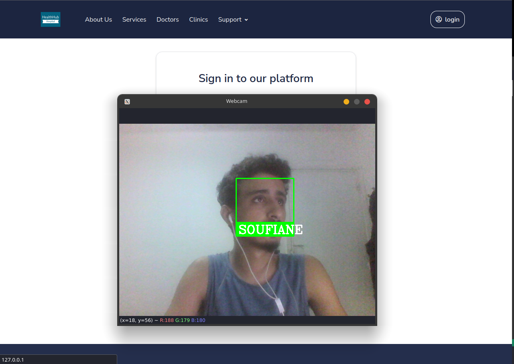
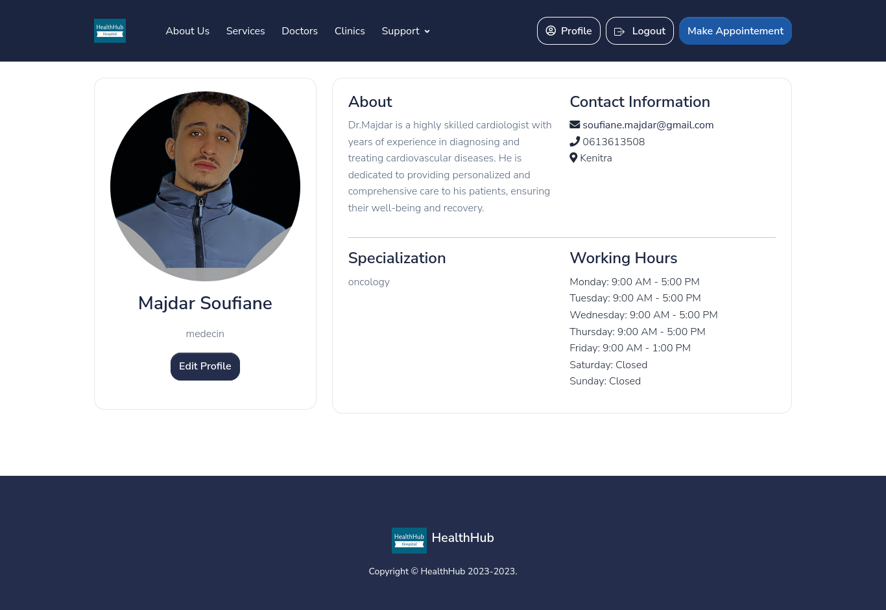
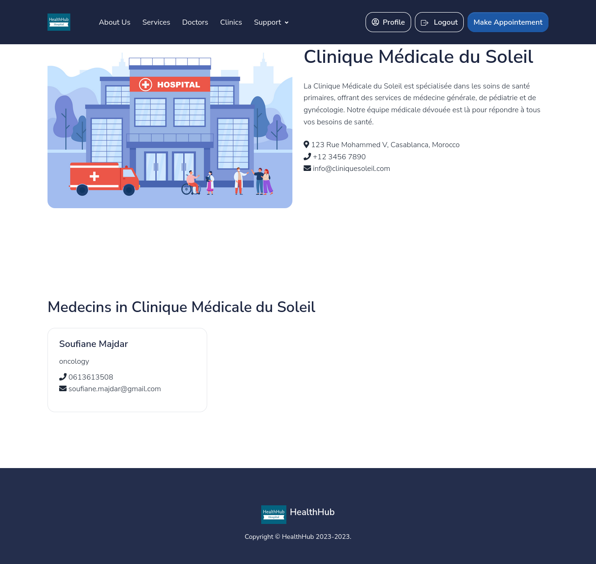
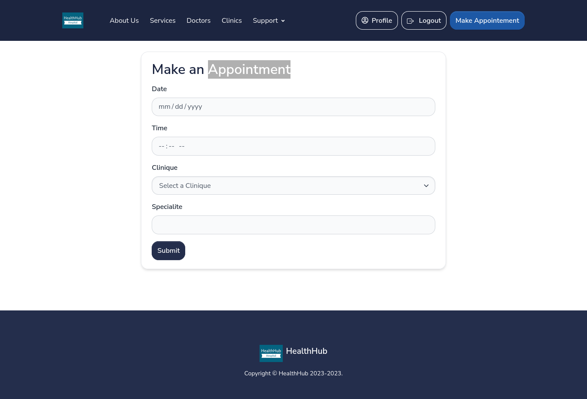
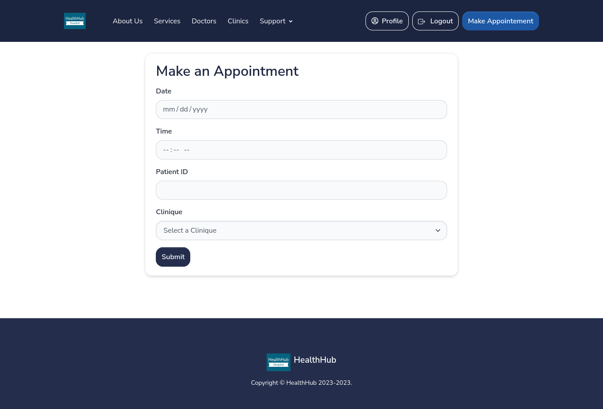

# HealthHub

HealthHub is a Django-based web application designed to streamline the management of clinics, doctors, patients, appointments, and medical records. It provides a platform for patients to schedule appointments with doctors, access medical records, and receive prescriptions. It also offers administrative features for managing clinics and user roles.

# Table of Contents

- [HealthHub](#healthhub)
- [Table of Contents](#table-of-contents)
  - [Features](#features)
  - [UML Diagram](#uml-diagram)
  - [Demo](#demo)
    - [Dashboard](#dashboard)
  - [Installation](#installation)
  - [Contributing](#contributing)

## Features

- User registration and authentication system for doctors, patients, secretaries, and administrators.
- Clinic management with details such as name, address, description, image, contact information, and website.
- Doctors can create their profiles with specialties, availability, contact information, and associated clinics.
- Patients can create profiles, update personal information, and view their medical records.
- Appointment scheduling system for patients to book appointments with doctors at specific clinics.
- Administrative functionalities for managing clinics, users, and appointments.
- Medical record management for doctors to create prescriptions, diagnose patients, and store relevant information.

## UML Diagram



The UML diagram provides an overview of the main entities and their relationships in the HealthHub application.

## Demo

### Dashboard

The dashboard provides to the admin an overview of the application. It displays the number of clinics, doctors, patients, and appointments in the system. It also provides links to the different management pages.



### Login

The login page allows users to authenticate themselves using (email, password) and face recognation. It also provides links to the registration page and password reset page.




### face recognation login



### Profile

The profile page displays the user's personal information and allows them to update their information.



### Doctor detail

The doctor details page displays the doctor's information.


### Clinic  details

The clinic details page displays the clinic's information.




### Make Appointment as a patient

The appointment page allows patients to book appointments with doctors at specific clinics. It displays the available doctors and their associated clinics. The patient can select a doctor and a clinic and choose a date and time for the appointment.



### Make Appointment as a Secretaire



## Installation

1. Clone the repository:

```shell
git clone https://github.com/your-username/HealthHub.git
```

2. Create a virtual environment:

```shell
cd HealthHub
python3 -m venv venv
```

3. Activate the virtual environment:

```shell
# For Unix/Linux
source venv/bin/activate

# For Windows
venv\Scripts\activate

```

4. Install the project dependencies:

```shell
pip install -r requirements.txt
```

5. Run database migrations:

```shell
python manage.py migrate
```

6. Start the development server:

```shell
python manage.py runserver
```

## Contributing

Contributions to HealthHub are welcome! If you encounter any issues or have suggestions for improvements, please create a new issue or submit a pull request.
